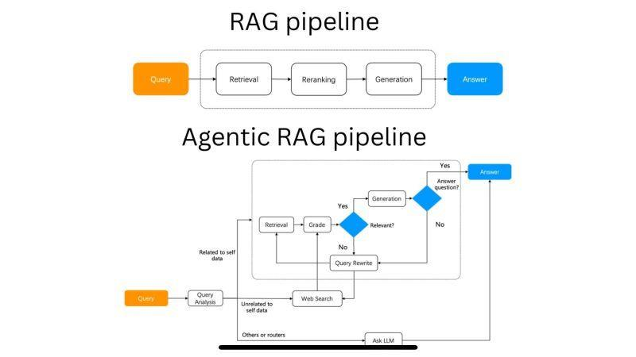
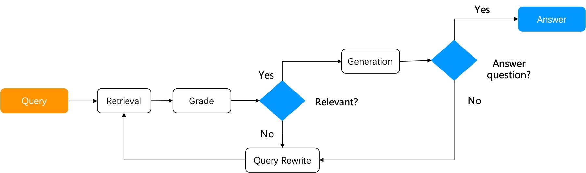

# Agentic RAG - Music Production Assistant

An intelligent Retrieval-Augmented Generation (RAG) system built with LangGraph that specializes in music production topics. This agentic workflow autonomously searches through PDF documents, validates relevance, and generates accurate answers using AWS Bedrock's Claude 4 Sonnet model.



## 🎵 Features

- **Intelligent Document Search**: Uses FAISS vector store with Cohere embeddings for semantic search
- **Relevance Validation**: AI-powered relevance checking to ensure search results match user queries
- **Query Rephrasing**: Automatically rephrases queries up to 3 times for better search results
- **Answer Validation**: Validates generated answers to ensure they properly address user queries
- **Contextual Compression**: Uses Cohere Rerank for improved retrieval quality
- **LangGraph Workflow**: Visual workflow orchestration with conditional branching
- **AWS Bedrock Integration**: Leverages Claude 4 Sonnet for high-quality text generation

## 🏗️ Architecture

The system implements an agentic workflow with the following nodes:

1. **User Intent**: Extracts the user query from chat messages
2. **Load Search Results**: Retrieves relevant documents using vector search
3. **Check Relevance**: Validates if search results are relevant to the query
4. **Rephrase Query**: Reformulates the query if results aren't relevant (max 3 attempts)
5. **Generate**: Creates an answer based on relevant search results
6. **Validate Generation**: Ensures the generated answer properly addresses the query
7. **Wrap Up**: Finalizes the response and returns it to the user



## 📋 Prerequisites

- **Python 3.13+**
- **uv** package manager
- **AWS Account** with Bedrock access
- **AWS CLI** configured with appropriate credentials

### Install uv

```bash
# macOS/Linux
curl -LsSf https://astral.sh/uv/install.sh | sh

# Windows
powershell -c "irm https://astral.sh/uv/install.ps1 | iex"
```

### AWS Configuration

Ensure your AWS credentials are configured with access to Bedrock services:

```bash
aws configure
```

Required Bedrock models in `eu-central-1` region:
- `eu.anthropic.claude-sonnet-4-20250514-v1:0` (Chat)
- `cohere.embed-multilingual-v3` (Embeddings)
- `cohere.rerank-v3-5:0` (Reranking)

## 🚀 Installation

1. **Clone the repository**:
   ```bash
   git clone https://github.com/UnikooBelgium/ws-agentic-rag
   cd ws-agentic-rag
   ```

2. **Install dependencies**:
   ```bash
   uv sync
   ```

3. **Set up environment variables** (or create `.env` file):
   ```bash
   # AWS credentials (if not using AWS CLI)
   AWS_ACCESS_KEY_ID=your_access_key
   AWS_SECRET_ACCESS_KEY=your_secret_key
   AWS_DEFAULT_REGION=eu-central-1
   ```

## 🎯 Usage

### Development Mode

Run the LangGraph development server:

```bash
uv run langgraph dev
```

This starts the interactive LangGraph Studio where you can:
- Visualize the workflow graph
- Test queries interactively
- Debug workflow execution
- Monitor state transitions

### Programmatic Usage

```python
from main import get_graph

# Initialize the graph
graph = get_graph()

# Run a query
result = graph.invoke({
    "messages": [("human", "What is compression in music production?")]
})

print(result["answer"])
```

## 📁 Project Structure

```
ws-agentic-rag/
├── main.py                    # Main workflow definition
├── langgraph.json            # LangGraph configuration
├── pyproject.toml            # Project dependencies
├── models/
│   └── state.py              # Agent state definitions
├── nodes/                    # Workflow nodes
│   ├── user_intent.py        # Extract user query
│   ├── load_search_results.py # Vector search
│   ├── check_relevance.py    # Relevance validation
│   ├── rephrase_query.py     # Query rephrasing
│   ├── generate.py           # Answer generation
│   ├── validate_generation.py # Answer validation
│   └── wrap_up.py            # Final response
├── utils/
│   ├── aws_bedrock.py        # AWS Bedrock clients
│   └── vector_store.py       # Vector store utilities
└── resources/
    ├── agentic-rag.jpg       # Architecture diagram
    ├── self-rag.png          # Process flow
    └── MakingMusic_DennisDeSantis.pdf # Sample document
```

## 📊 Workflow Logic

### Conditional Branching

- **After Relevance Check**: 
  - If results are relevant OR 3 rephrases attempted → Generate answer
  - Otherwise → Rephrase query

- **After Generation Validation**:
  - If answer addresses query → Wrap up
  - Otherwise → Rephrase query and retry

### State Management

The `AgentState` tracks:
- User messages and queries
- Search results and relevance
- Generated answers and validation
- Rephrased queries history

## 🎼 Music Production Context

The system is specifically optimized for music production topics including:
- Music theory and composition
- Sound design and synthesis
- Audio engineering and mixing
- Production techniques and workflows
- Equipment and software recommendations

## 🛠️ Development

### Adding New Documents

Place PDF documents in the `resources/` folder and update the vector store loading:

```python
# In nodes/load_search_results.py
vector_store = load_vector_store("resources/your-document.pdf")
```

### Customizing Prompts

Modify system prompts in individual node files to adjust behavior:
- `nodes/check_relevance.py` - Relevance assessment
- `nodes/generate.py` - Answer generation style
- `nodes/validate_generation.py` - Answer quality criteria

### Adding New Nodes

1. Create new node file in `nodes/`
2. Add node to workflow in `main.py`
3. Update state model if needed in `models/state.py`

## 📝 Dependencies

Key dependencies include:
- **LangGraph** (0.6.3+) - Workflow orchestration
- **LangChain** (0.3.x) - AI application framework
- **FAISS** (1.11.0+) - Vector similarity search
- **AWS Bedrock** - Claude 4 Sonnet and Cohere models
- **PyPDF** (5.9.0+) - PDF document processing

## 📄 License

This project is licensed under the MIT License - see the LICENSE file for details.

## 🤝 Contributing

1. Fork the repository
2. Create a feature branch
3. Make your changes
4. Add tests if applicable
5. Submit a pull request

## 🔍 Troubleshooting

### Common Issues

1. **AWS Credentials**: Ensure proper AWS credentials and Bedrock access
2. **Model Access**: Verify access to required Bedrock models in eu-central-1
3. **Memory Issues**: Large PDFs may require increased memory allocation
4. **Cache Issues**: Clear vector store cache if documents are updated

### Debug Mode

Enable debug logging:

```python
import logging
logging.basicConfig(level=logging.DEBUG)
```

---

Built with ❤️