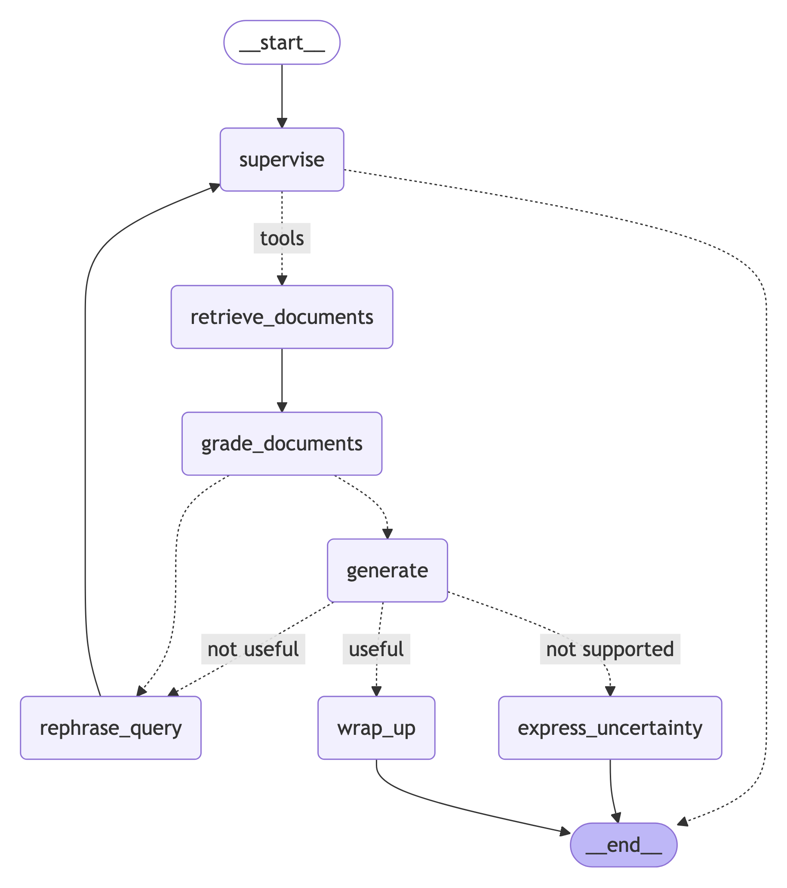

# Agentic RAG - Music Production Assistant

An intelligent Retrieval-Augmented Generation (RAG) system built with LangGraph that searches through PDF documents and generates accurate answers using AWS Bedrock's Claude 4 Sonnet model.



## 🚀 Quick Start

### Prerequisites

- **Python 3.13+**
- **uv** package manager
- **AWS Account** with Bedrock access
- **AWS CLI** configured with appropriate credentials

### Install uv

```bash
# macOS/Linux
curl -LsSf https://astral.sh/uv/install.sh | sh

# Windows
powershell -c "irm https://astral.sh/uv/install.ps1 | iex"
```

### AWS Configuration

Ensure your AWS credentials are configured with access to Bedrock services:

```bash
aws configure
```

Required Bedrock models in `eu-central-1` region:
- `eu.anthropic.claude-sonnet-4-20250514-v1:0` (Chat)
- `cohere.embed-multilingual-v3` (Embeddings)
- `cohere.rerank-v3-5:0` (Reranking)

### Setup

1. **Clone and install**:
   ```bash
   git clone https://github.com/UnikooBelgium/ws-agentic-rag
   cd ws-agentic-rag
   uv sync
   ```

2. **Configure AWS** (if not already done above):
   ```bash
   aws configure
   ```

3. **Run the application**:
   ```bash
   uv run langgraph dev
   ```

This opens LangGraph Studio where you can visualize the workflow and test queries interactively.

## 🎯 Features

- **Smart Document Search** with ChromaDB + Cohere embeddings
- **Relevance Filtering** to grade document quality
- **Self-Correcting Queries** with automatic rephrasing (max 3x)
- **Answer Validation** with hallucination detection
- **Uncertainty Handling** when confidence is low

## 📁 Architecture

Self-correcting RAG workflow: **User Intent** → **Load Documents** → **Grade Documents** → **Generate** → **Grade Answer** → **Wrap Up**

**Smart Routing:**
- No relevant docs or 3 rephrases → Generate anyway
- Good answer → Wrap up
- Hallucinated answer → Express uncertainty
- Poor answer → Rephrase and retry

## 🛠️ Programmatic Usage

```python
from main import get_graph

graph = get_graph()
result = graph.invoke({
    "messages": [("human", "What is compression in music production?")]
})
print(result["messages"])
```

## 📄 License

MIT License - see LICENSE file for details.